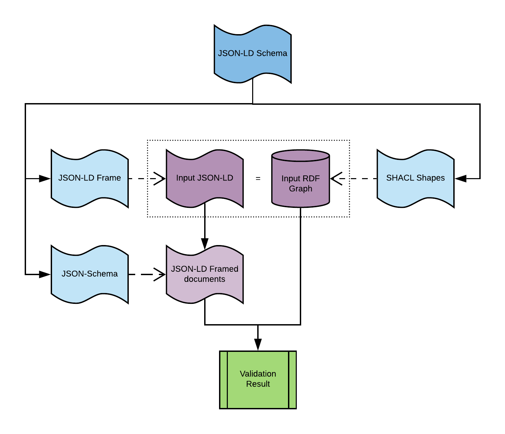

# JSON-LD Schema

Simple schema validation for linked data.



## Why?
Schema validation is an important use case in API development but a simple and efficient solution based on the validation of JSON-LD documents does not exist. 

JSON-LD documents can be seen from two points of view: as regular JSON documents following certain conventions or as RDF graphs encoded using JSON syntax.
Validation mechanisms indeed exist for both ways of looking at the information in a JSON-LD document, but each of them has important drawbacks when working with JSON-LD:

- **JSON-Schema** can be used to validate JSON-LD as plain JSON documents. However, the information in a JSON-LD document can be encoded through multiple, syntactically different, documents, so it is hard to write a generic JSON-Schema validation without going through a normalisation step, and even if the validation is written for a normalised JSON-LD document, the description of the validation becomes verbose and complex to write, relying, for example, on the usage fo fully expanded URIs. There is also the issue of the implications for the validity of the RDF information encoded in the document when we are just validating the JSON syntax.
- **SHACL** can be used to validate the RDF graph encoded in the JSON-LD document. SHACL is powerful and expressive but difficult to write and learn, especially for users that do not want to work with JSON-LD as an RDF format. Additionally, the performance of SHACL validators is far from the performance of syntactical JSON-Schema validators


Taking these two already existing validation mechanisms in consideration, JSON-LD Schema tries to bridge the gap between both standards proposing
a small [JSON-Schema vocabulary](https://json-schema.org/draft/2019-09/json-schema-core.html#rfc.section.8.1.2) that can be used to write a simple JSON-Schema document that then can be applied with the same validation semantics than an equivalent SHACL validation over the RDF graph encoded in the target JSON-LD document but with the simplicity and runtime performance of a regular JSON Schema.

## Usage

JSON-LD Schema is provided as a typescript library exposing a single function `validate` that accepts a parsed JSON-LD document and JSON-LD Schema:

```typescript
import * as jsonldSchema from "jsonldSchema";

// parse input data and schema
let input = JSON.parse(fs.readFileSync("test_data.json").toString());
let schema = JSON.parse(fs.readFileSync("test_schema.json").toString());

// executes the validation
let res = await jsonldSchema.validate(input, schema);

// we check if the document validates
if (!res.validates) {
  console.log("Errors found: " + res.totalErrors);

  // let's display all the nodes that have failed the validation
  for (let nodeId in res.results) {
    let validationResult = res.results[nodeId];
    // ...
  }
}
```

## How does it work?

JSON-LD Schema defines a simple ['semantics' JSON-Schema vocabulary](docs/vocabulary.json) (effectively a JSON-Schema meta-schema) that reuses the official [JSON Schema
for JSON-LD](https://github.com/json-ld/json-ld.org/blob/master/schemas/jsonld-schema.json) to provide definitions for `@context` and `@type` properties. These annotations can be used to provide JSON-LD context for a JSON-Schema document.
Provided this JSON-LD context, constraints over named 'properties' in a JSON Schema document can be understood as constraints
over CURIES of JSON-LD documents following the context rules defined in the JSON-LD specification.

This is an example of a simple JSON-LD Schema document:

```json
{
  "@context": {
    "sorg": "http://schema.org/"
  },
  "@type": "sorg:Person",
  "type": "object",
  "properties": {
    "sorg:givenName": {
      "type": "string"
    },
    "sorg:gender": {
      "type": "string",
      "pattern": "male|female"
    }
  },
  "required": [ "sorg:name", "sorg:gender"]
}
```

This schema could be used directly to validate using a JSON Schema validator JSON-LD documents sharing the same context and expected
document structure, but this is not a valid general assumption.
To validate any JSON-LD document, a JSON-LD Schema validator must first transform this JSON-LD Schema, according to a well-defined set of rules, into a matching
[JSON-LD frame](https://www.w3.org/TR/json-ld11-framing/) that can be used to select nodes from the target JSON-LD document.

In the case of the previously shown JSON-LD Schema, the equivalent JSON-LD frame for that schema would be:

```json
{
  "@context": {
    "sorg": "http://schema.org/"
  },
  "@type": [ "sorg:Person"]
}
```

The JSON-LD Schema validator must apply the derived JSON-LD frame to any input JSON-LD document to process and validate
each of them framed JSON-LD documents against the original JSON-LD Schema using a regular JSON Schema validator.

Applying the JSON Schema validation to the framed JSON-LD is equivalent to apply a SHACL validation for a 
SHACL shape that was mapped from the JSON-LD Schema according to a fixed set of mapping rules.
In this example the matching SHACL shape would be:

```json
{
  "sh:class": {
    "@id": "http://schema.org/Person"
  },
  "sh:property": [
    {
      "sh:path": {
        "@id": "http://schema.org/givenName"
      },
      "sh:datatype": {
        "@id": "xsd:string"
      }
    },
    {
      "sh:path": {
        "@id": "http://schema.org/gender"
      },
      "sh:datatype": {
        "@id": "xsd:string"
      },
      "sh:pattern": "male|female",
      "sh:minCount": 1
    },
    {
      "sh:path": {
        "@id": "http://schema.org/name"
      },
      "sh:minCount": 1
    }
  ],
  "@type": "sh:NodeShape",
  "@context": {
    "sh": "http://www.w3.org/ns/shacl#",
    "xsd": "http://www.w3.org/2001/XMLSchema#"
  }
}
```
## Limitations

JSON-LD schema is just a way of  using pragamatically two complementary solutiosn built by different communities. 

We are not trying to provide a different way of providing semantics for a JSON document through the JSON-LD Schema `@context`, or lift JSON documents into JSON-LD documents applying some kind of schema as a style-sheet mechanism. The JSON-LD Schema is geared towards validating already existing JSON-LD documents and not every arbitrary JSON-Schema could be transformed into a useful (although maybe syntactically valid) JSON-LD Schema. Specific rules about dealing with arrays and collections might be added.

In the same way, JSON-LD Schema is not meant to be a replacement for SHACL. Only a subset of the expressivity of SHACL will be supported in JSON-LD Schema although some specific validation rules in JSON-Schema, when applied to the framed JSON-LD documents, might not find a translation to standard SHACL constraints, requiring custom SHACL constraints to provide a 1 to 1 translation.

## Status

The current project is in its initial stage and can be considered pre-alpha.

The current code can apply basic JSON-LD Schema validations and generate the equivalent SHACL validations for the JSON-LD Schema.

An initial test suite is also supported that checks the translation of JSON-LD Schemas into JSON-LD frames and SHACL constraints and checks that the validation of a particular JSON-LD Schema over a JSON-LD document matches the validation result of applying the SHACL shape.

Rules for mapping from JSON-LD Schema to JSON-LD frames and SHACL haven't been extracted from the code yet.